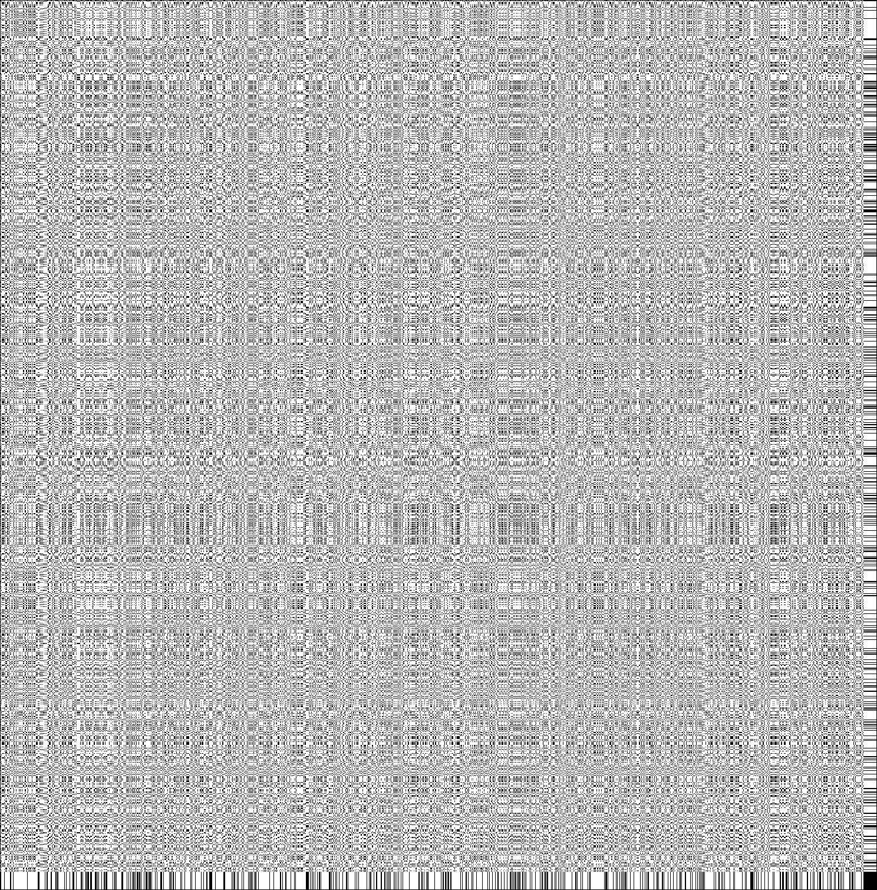

# TyMA-2021

## Index

- [1. Downloading this repository](#1.-Downloading-this-repository)
- [2. Installing C compiler, Python and dependencies](#2.-Installing-C-compiler,-Python-and-dependencies)
- [3. C compiler](#3.-C-compiler)
- [4. Installing Python 3.x](#4.-Installing-Python-3.x)
- [5. Python packages](#5.-Python-packages)
- [6. Compiling C code](#6.-Compiling-C-code)
- [7. Running the generators](#7.-Running-the-generators)
  - [7.1 generate_dotplot](#7.1-generate_dotplot)
  - [7.2 generate_dotplot_word_thresh](#7.2-generate_dotplot_word_thresh)
- [8. Generating images with Python](#8.-Generating-images-with-Python)

## 1. Downloading this repository

To save this git repository to your machine, just execute

```bash
git clone https://github.com/olegbrz/TYMA-2021
```

If you don't want to install Git (although you should...), you can just save it as `.zip`.

## 2. Installing C compiler, Python and dependencies

In order to use this program, you need to install:

- C compiler
- Python 3.x
- numpy and matplotlib Python packages

## 3. C compiler

If you are using Linux, you most probably have already the `gcc` compiler installed and on the path.

For Windows, MinGW compiler is recommended. It can be downloaded from:

[http://mingw-w64.org/doku.php/download](http://mingw-w64.org/doku.php/download).

To check the installation, run:

```bash
gcc --version
```

The output should look like this:

```bash
gcc (MinGW.org GCC Build-20200227-1) 9.2.0
Copyright (C) 2019 Free Software Foundation, Inc.
This is free software; see the source for copying conditions.  There is NO
warranty; not even for MERCHANTABILITY or FITNESS FOR A PARTICULAR PURPOSE.
```

## 4. Installing Python 3.x

Python comes preinstalled on most Linux distributions, and is available as a package on all others.

For Windows, Python can be downloaded from:

[https://www.python.org/downloads/](https://www.python.org/downloads/).

**Attention! Make sure to check "Add Python 3.x to PATH" when installing. Otherwise, you will have to do it manually.**


To check the installation, run

```bash
python --version

pip --version
```

## 5. Python packages

[`dotplot.py`](./src/dotplot.py) uses [`numpy`](https://numpy.org/) and [`matplotlib`](https://matplotlib.org/).

You can install both with

```bash
pip install numpy
pip install matplotlib
```

## 6. Compiling C code

In order to compile the C code, just execute

- `make all` (in Linux)
- [`make-windows.bat`](make-windows.bat) (in Windows)

The binaries will be compiled in [`./bin/`](./bin).

## 7. Running the generators

### 7.1 generate_dotplot

Execute

```bash
generate_dotplot <s1> <s2> <output>
```

where:

- `s1`: first `.fasta` sequence
- `s2`: second `.fasta` sequence
- `output`: the output file (plain text)

### 7.2 generate_dotplot_word_thresh

Execute

```bash
generate_dotplot <s1> <s2> <W> <T> <output>
```

where:

- `s1`: first `.fasta` sequence
- `s2`: second `.fasta` sequence
- `W`: search window size
- `T`: threshold
- `output`: the output file (plain text)

## 8. Generating images with Python

The final step is generating the image dotplot from the plain file generated with C, to use it, execute:

```bash
python ./src/dotplot.py <generated file>
```

The result will be saved in `./results/` and it will look like this:


